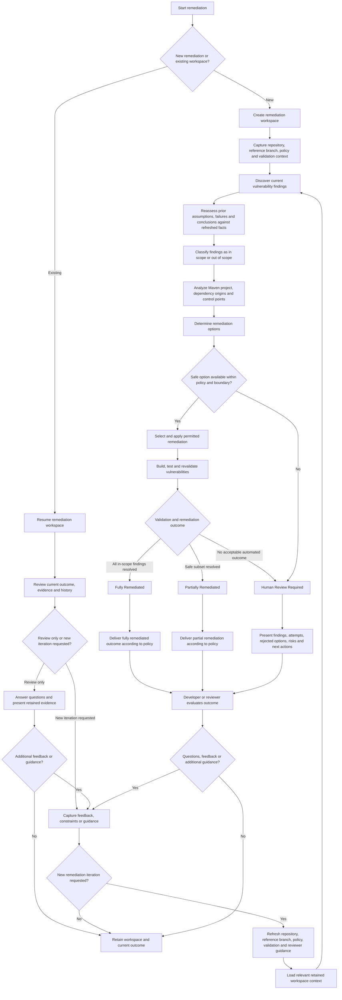

# Enterprise OSS Remediation Platform
## Business Requirements Baseline

**Status:** Baselined  
**Version:** 1.3  
**Repository:** `AILearner365/oss-remediation-adk`  
**Baseline branch:** `docs/srs-requirements-foundation`

---

## 1. Purpose

This document defines the business intent, scope, boundaries, outcomes, and governing requirements for the Enterprise OSS Remediation Platform.

It is the primary reference used to confirm that architecture, detailed design, implementation, tests, and release outcomes remain aligned with the approved product needs.

This document defines **what the platform must achieve**. Architecture, agent responsibilities, orchestration, prompts, persistence, state management, APIs, deployment topology, and implementation details are defined in later engineering documents.

---

## 2. Business Context

Enterprise Java teams routinely receive OSS vulnerability findings affecting application dependencies, Maven plugins, parent POMs, BOMs, dependency-management entries, and transitive dependency paths.

In Maven multi-module projects, one vulnerable component may be declared or controlled at different levels and may affect multiple modules. Safe remediation therefore requires more than selecting a newer version. It requires understanding dependency origin, project structure, compatibility constraints, policy boundaries, validation expectations, residual risk, and review requirements.

Manual remediation is repetitive, time-consuming, and dependent on individual developer experience. It also often lacks consistent evidence explaining why one remediation was selected, why alternatives were rejected, what validation was performed, and what risks remain.

---

## 3. Problem Statement

Given a Java Maven Spring Boot multi-module repository containing OSS vulnerabilities, the platform must support the end-to-end remediation lifecycle from repository intake through vulnerability analysis, remediation, validation, completion-state determination, pull-request delivery, and technical-review continuation.

The platform must reduce manual effort and remediation time without compromising project stability, configured policy boundaries, validation quality, traceability, or reviewability.

The platform must preserve enough context and evidence for developers and reviewers to understand, question, continue, and refine a remediation after the initial execution completes.

---

## 4. Product Goal

Provide the safest practical validated remediation with the least practical manual effort.

The platform must support:

- autonomous remediation initiated through CI/CD
- user-initiated remediation through an interactive interface
- continuation of an existing remediation workspace
- technical review, follow-up questions, additional guidance, and post-review updates
- persistent operational history for auditability and product improvement

---

## 5. Primary Users and Stakeholders

### Primary user

A Java developer responsible for a Java Maven Spring Boot multi-module repository.

### Additional stakeholders

- pull-request reviewers and technical leads
- application teams
- platform and build-engineering teams
- security and compliance teams
- policy administrators
- platform administrators
- release and quality-assurance teams

---

## 6. Core Business Concepts

### Project

A broader application or product that may contain one or more repositories.

### Repository

A source-code repository containing a Java Maven Spring Boot multi-module project or a component of a broader project.

### Reference branch

The authoritative starting point for remediation and the intended target branch for a remediation pull request.

### Remediation policy

The approved operating boundary for a remediation workflow. It may include:

- severity threshold
- permitted remediation strategies
- permitted upgrade ranges
- preferred or blocked versions
- dependency exclusions
- accepted risk levels
- remediation boundary
- validation scope
- organization-specific rules

### Validation scope

The complete set of verification activities required to determine whether an applied remediation is acceptable.

### Remediation boundary

The configured limit on the types of changes the platform may make. The initial release excludes Java source-code changes and upgrades that require such changes.

### Remediation workspace

A persistent record of one remediation workflow for a repository and reference branch. It retains inputs, findings, policies, decisions, attempts, changes, validation results, evidence, completion state, pull-request linkage, review discussions, and later iterations.

### Remediation iteration

One execution or revision of remediation activity inside a workspace.

### Current context

The repository, reference branch, policy, validation, vulnerability, dependency, and reviewer-guidance information that is current for a remediation iteration.

### Retained workspace context

The historical findings, decisions, attempts, failures, validations, risks, pull-request state, review discussions, and other evidence retained from earlier iterations.

### Review-ready

A result containing enough implementation detail, evidence, validation results, decision history, rejected alternatives, residual-risk information, and reviewer guidance to support technical evaluation without hidden workflow knowledge.

---

## 7. Entry Points and User Journeys

### CI/CD-initiated remediation

GitHub Actions initiates remediation using the repository, reference branch, severity threshold, policy, and validation configuration. The workflow runs autonomously and leaves a persistent workspace for later review or continuation.

### User-initiated remediation

A user starts a new remediation through an ADK-supported interactive interface using the same core repository and branch context.

### Existing-workspace continuation

An authorized user may reopen a workspace, including months later, to:

- review prior findings and decisions
- inspect evidence and validation outcomes
- ask questions without starting a new remediation iteration
- provide constraints or reviewer guidance
- request another remediation iteration
- update an existing pull request
- create a pull request when a safe remediation later becomes available

When another remediation iteration is requested, the platform must refresh the current context, retain relevant historical evidence, and reassess prior conclusions against the refreshed facts before continuing.

### Collaboration

Multiple authorized users may access the same workspace over its lifecycle. The platform must prevent conflicting active remediation updates in the same workspace.

Different users may work concurrently on different repositories, different branches, or different workspaces. Duplicate active remediation for the same repository and reference branch must be controlled.

---

## 8. Business Remediation Workflow

The following activity flow represents the approved business journey. It intentionally describes the user-facing remediation lifecycle without defining system components, agents, services, storage, APIs, or deployment choices.

### Continuation rule

A new iteration must use both:

- refreshed current context, because repository state, policy, validation configuration, vulnerability findings, and reviewer guidance may have changed
- relevant retained workspace context, because earlier findings, decisions, failures, validations, risks, and review history remain important evidence

Prior conclusions must be reassessed against refreshed facts. The platform must not blindly reuse stale conclusions or discard relevant history.

### Business stage summary

| Business stage | Purpose | Information produced or retained |
|---|---|---|
| Start or resume | Begin a new remediation or access prior work | Repository, reference branch, initiator, workspace selection |
| Review existing workspace | Understand the current outcome without forcing a new iteration | Prior findings, decisions, evidence, validation results, pull-request state |
| Capture feedback | Record questions, constraints, or reviewer guidance | Questions, answers, approved guidance, new constraints |
| Refresh context | Establish the current non-vulnerability facts for a new iteration | Latest repository and branch state, policy, severity, exclusions, validation scope, reviewer guidance |
| Load retained context | Retrieve relevant evidence from earlier iterations | Prior attempts, failures, selected and rejected options, validations, risks, review history |
| Vulnerability discovery | Establish the current vulnerability state | Current findings, severities, affected components, provider evidence |
| Reassess retained context | Determine which prior evidence and conclusions remain relevant after refresh | Changed assumptions, still-relevant failures, invalidated conclusions, reusable evidence |
| Scope classification | Decide which findings are included in the iteration | In-scope and out-of-scope findings with reasons |
| Project analysis | Understand how vulnerable components enter and are controlled | Maven modules, dependency origins, control points, impacted modules |
| Remediation decision | Select the safest practical option | Candidate options, selected option, rejected alternatives, risk rationale |
| Change execution | Apply only permitted modifications | Changed files, version changes, boundary-compliance evidence |
| Validation | Verify technical acceptability | Build, test, vulnerability revalidation, conflicts, regressions |
| Completion | Assign the business outcome | Fully Remediated, Partially Remediated, or Human Review Required |
| Delivery | Deliver the outcome according to policy | Branch and pull request when required, reports, evidence, unresolved findings, residual risk |
| Retention | Preserve the complete remediation record | Inputs, decisions, attempts, validations, review history, current outcome |

The System Architecture, Detailed Design, implementation, and verification must preserve this business workflow and its completion-state behavior. Technical decomposition may add internal steps but must not remove, bypass, or redefine the approved business stages or outcomes without an approved change to this baseline.

---

## 9. Initial Release Scope

The initial release includes:

- GitHub repositories
- GitHub Actions integration
- ADK-supported web or terminal interaction
- Java Maven Spring Boot multi-module projects
- Critical and High vulnerabilities by default
- configurable severity through Low, with higher severities included automatically
- OSS dependency and Maven plugin remediation
- parent POM, BOM, dependency-management, direct-dependency, and transitive-dependency analysis
- configurable remediation policies
- default Maven build, test, and vulnerability validation
- repository-specific custom validation configuration
- no Java source-code changes
- persistent remediation workspaces
- full, partial, and human-review-required outcomes
- remediation branch and pull-request creation or update when safe validated changes exist, unless automated delivery is explicitly disabled by policy
- interactive review and post-review continuation
- decision, evidence, validation, and review-history retention

---

## 10. Platform Extension Direction

The platform must be designed to accommodate later support for:

- Bitbucket and other source-control systems
- TeamCity and other CI/CD platforms
- existing vulnerability reports as inputs
- multiple pluggable vulnerability providers
- custom validation providers
- Java source-code remediation
- major Java, Spring Boot, or framework upgrades
- additional build systems and languages
- broader coordination across multiple repositories
- additional workspace evidence types, reviewer inputs, provider metadata, validation results, and remediation strategies without fundamental redesign

These are extension directions, not initial-release commitments.

### Future data and product-improvement requirements

The platform must distinguish between:

- workspace-specific evidence used to understand and continue one remediation
- aggregated operational insights used to guide future product improvement

Workspace-specific evidence may expand over time as new providers, validations, remediation types, and reviewer inputs are introduced.

Aggregated operational insights may include recurring failure patterns, unsupported project structures, reviewer corrections, provider reliability, strategy success rates, and iteration patterns. Such insights must not silently change active remediation policy, completion rules, or repository-specific decisions, and must remain subject to security, privacy, authorization, and retention requirements.

---

## 11. Required Business Capabilities

The platform must provide the following capability groups. Detailed ownership and implementation are defined in the Capability Model and Architecture documents.

1. Repository and branch intake
2. Remediation policy and validation configuration
3. Workspace creation, persistence, reopening, and controlled collaboration
4. CI/CD and interactive workflow initiation
5. Vulnerability discovery or findings ingestion
6. Maven multi-module and dependency-control analysis
7. Safe remediation planning and execution
8. Failure-informed remediation iteration
9. Build, test, vulnerability, and custom validation
10. Completion-state determination
11. Branch and pull-request delivery
12. Evidence, decision, and execution-history retention
13. Reviewer question answering and feedback-driven continuation
14. Security, authorization, auditability, and sensitive-data protection
15. Operational insight collection for future product improvement

---

## 12. Completion States

Every remediation iteration must reach exactly one completion state after the applicable remediation and validation activities conclude. A completion state does not close the workspace.

### Fully Remediated

All in-scope vulnerability findings are resolved and all required validations pass. When safe validated changes exist, the platform must create or update the remediation branch and review-ready pull request unless automated delivery is explicitly disabled by policy.

### Partially Remediated

A safe subset of findings is resolved. All applied changes pass their required validations. Remaining findings are documented and remain unresolved because they exceed the permitted remediation boundary or cannot be addressed safely under current constraints. When safe validated changes exist, the platform must create or update a pull request clearly identified as partial remediation, including unresolved findings, reasons, risks, and recommended next actions, unless automated delivery is explicitly disabled by policy.

### Human Review Required

The platform cannot safely produce an automated remediation under the current inputs, policies, evidence, validation results, or remediation boundary. The workspace must retain findings, attempts, rejected alternatives, validation results, risks, and recommended next actions. A pull request is not required when no safe validated change exists.

Authorized users may continue the workspace through questions, feedback, updated constraints, refreshed context, and additional iterations.

---

## 13. Governing Principles

- Safety before automation
- Validation before completion
- Evidence before recommendation
- Traceability by default
- Reviewability by default
- Refresh current facts before a new iteration
- Retain and reassess relevant historical evidence
- Transparency of failures, rejected options, assumptions, limitations, and residual risk
- Configurability over hard-coding
- Deterministic tools and evidence where practical
- LLM reasoning for contextual interpretation where deterministic methods are insufficient
- Human collaboration when safe automated progress is unavailable
- Extensibility without fundamental redesign

---

## 14. Technology Constraints

- The initial platform implementation uses the Agent Development Kit (ADK).
- The platform uses a multi-agent workflow model.
- LLM capabilities support contextual reasoning, planning, explanation, and interactive review.
- Deterministic tools and verifiable outputs remain authoritative for repository state, dependency resolution, vulnerabilities, builds, tests, and validation results.

---

## 15. Assumptions and External Dependencies

The platform assumes authorized access to the repository, reference branch, build environment, artifact repositories, vulnerability provider, validation providers, approved LLM service, and required enterprise identity and secret-management services.

The owning team must provide repository-specific prerequisites, remediation policy, and custom validation configuration when defaults are insufficient.

The platform depends on the availability and correctness of GitHub, GitHub Actions, Maven and artifact repositories, vulnerability providers, validation providers, LLM services, identity services, network connectivity, and repository-owner participation when human input is required.

---

## 16. Open Decisions

The following decisions remain unresolved and must be completed before the affected capabilities are baselined for release:

- duplicate-workspace behavior: block, warn, queue, or resume
- final role and permission model
- workspace and audit-retention duration
- numerical availability and recovery targets
- supported concurrent workspace count
- maximum supported repository and Maven reactor size
- maximum remediation execution duration
- branch commit-history policy across review iterations
- policy for disabling automated branch or pull-request delivery
- permitted aggregation and retention rules for operational-improvement data

---

## 17. Governance and Traceability

This business requirements baseline is the authoritative source for product intent and release acceptance.

Each capability, architecture component, design element, implementation item, and verification test must reference the business requirement, business workflow stage, or capability it satisfies.

Approved identifiers and the approved business workflow must remain stable. Retired identifiers must not be reused.

Changes to this baseline require review when they alter business scope, workflow stages, continuation behavior, boundaries, completion states, delivery behavior, technology constraints, or governing principles.
