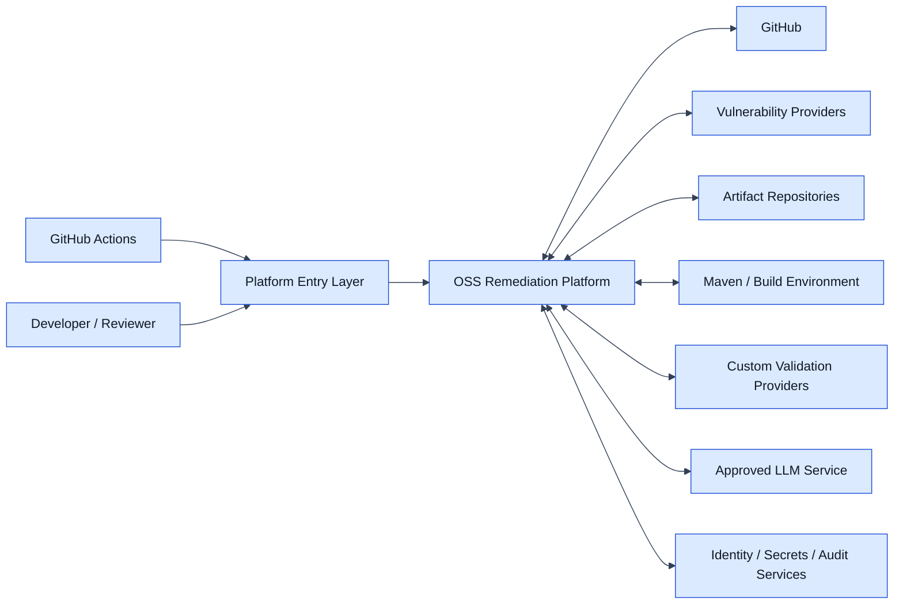
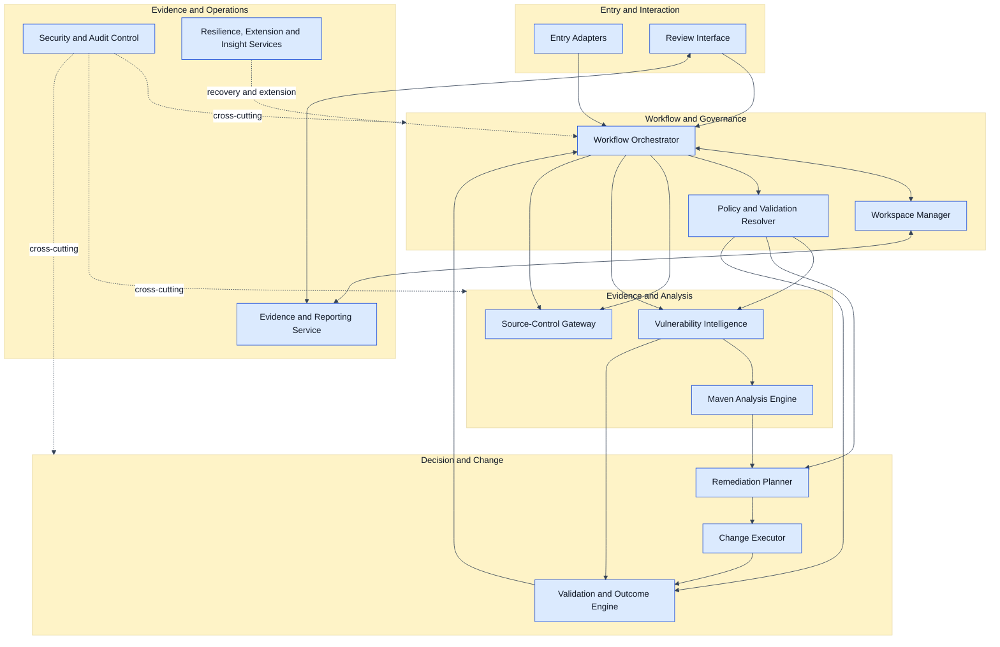
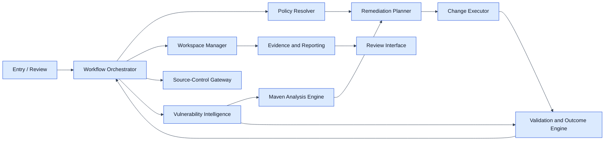
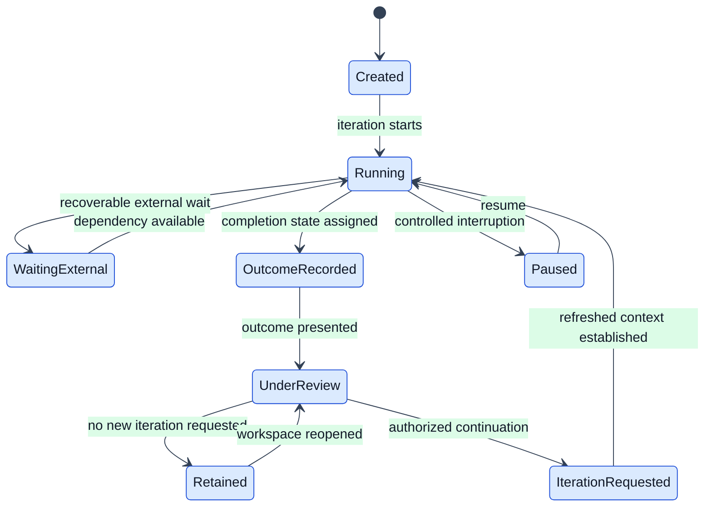
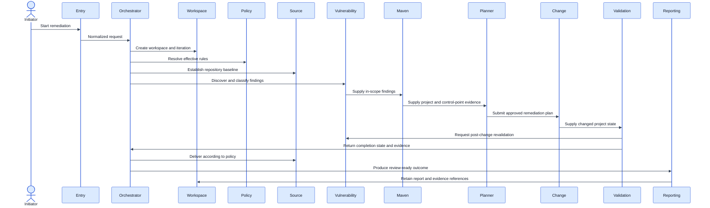
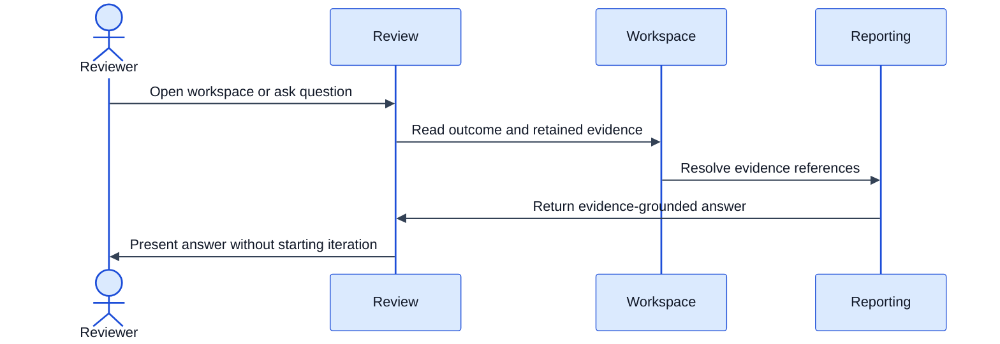
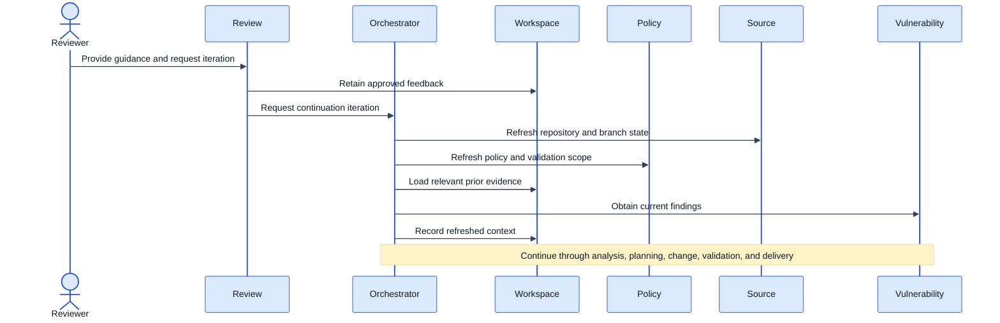

# Enterprise OSS Remediation Platform
## System Architecture

**Status:** Draft for review  
**Version:** 0.2

---

## 1. Purpose

This document defines the logical architecture that fulfills the approved platform responsibilities while preserving the authoritative [Business Remediation Workflow](./01-business-requirements.md#8-business-remediation-workflow).

It is authoritative for:

- logical architectural components
- component boundaries and dependency direction
- major interactions and integration boundaries
- workspace, evidence, and technical-state ownership
- architecture invariants
- placement of ADK/LLM reasoning versus deterministic execution

It does not redefine business behavior, platform capabilities, or responsibility ownership. Prompts, APIs, storage schemas, classes, deployment manifests, and implementation packages belong to Detailed Design.

---

## 2. Architecture Principles

1. **Business workflow remains authoritative.** Architecture maps to the workflow; it does not replace it.
2. **Responsibility ownership is preserved.** Components follow the [Platform Responsibility Model](./03-platform-responsibility-model.md).
3. **Deterministic evidence is authoritative.** Repository state, Maven resolution, vulnerability results, builds, tests, and completion evidence come from deterministic tools or external systems.
4. **LLM reasoning is bounded.** LLMs support contextual reasoning and explanation but do not fabricate tool results or independently approve changes.
5. **Workspace continuity is explicit.** Review-only access is separate from a new remediation iteration.
6. **Current facts and retained history are distinct.** New iterations refresh current facts and reassess relevant prior evidence.
7. **Change execution and approval are separated.** The component that applies changes does not determine final completion.
8. **Provider boundaries are pluggable.** Source control, vulnerability, validation, and future providers are accessed through stable ports.
9. **Security, authorization, and audit are cross-cutting.** They apply to every entry point, component, tool call, and retained artifact.
10. **Operational insight cannot silently change runtime behavior.** Product-learning data informs later approved changes only.

---

## 3. Architecture Invariants

The following rules must remain true in every implementation:

1. Only the **Workflow Orchestrator** may start, resume, advance, pause, or terminate a remediation iteration.
2. Only the **Validation and Outcome Engine** may assign the technical completion state.
3. The **Change Executor** may apply an approved change but may not approve or validate its own result.
4. The **Remediation Planner** may propose and select plans but may not directly modify repository files or source-control state.
5. The **Source-Control Gateway** owns repository, branch, commit, push, and pull-request operations but not remediation semantics.
6. The **Workspace Manager** preserves context and evidence references but does not invent technical evidence.
7. The **Evidence and Reporting Service** reads authoritative evidence and produces explanations; it does not change workflow or repository state.
8. Review-only access must not create a new iteration unless an authorized user explicitly requests one.
9. A continued iteration must refresh current facts before reusing prior conclusions.
10. Fully or Partially Remediated cannot be reported without the required validation evidence.
11. Provider-specific behavior must remain behind architectural gateways or ports.
12. An ADR cannot silently override business behavior, capability ownership, or responsibility ownership.

---

## 4. System Context

Inside the platform boundary are workflow coordination, workspace management, policy resolution, vulnerability classification, Maven analysis, remediation planning, change execution, validation, reporting, and review support.

External systems remain authoritative for source control, CI/CD execution, vulnerability-source data, artifact repositories, build infrastructure, identity, secrets, audit, and the approved LLM service.

---

## 5. Logical Component Model

---

## 6. Component Responsibilities

| Component | Architectural purpose | Responsibility mapping | Key capabilities |
|---|---|---|---|
| Entry Adapters | Normalize CI/CD and interactive requests into platform commands | RESP-01; supports RESP-02, RESP-11 | CAP-01, CAP-06, CAP-25 |
| Review Interface | Present evidence, accept questions and feedback, and distinguish review-only from new iteration | RESP-10; supports RESP-01, RESP-04 | CAP-22, CAP-23, CAP-24 |
| Workflow Orchestrator | Coordinate stages, iterations, retries, continuation, and termination | RESP-01 | CAP-06, CAP-14, CAP-24 |
| Policy and Validation Resolver | Resolve effective policy, scope, boundaries, delivery policy, and validation configuration | RESP-03 | CAP-02, CAP-03; supports CAP-08 |
| Workspace Manager | Own workspace identity, lifecycle, iteration history, collaboration control, and evidence references | RESP-04 | CAP-04, CAP-05, CAP-21 |
| Source-Control Gateway | Read repository state and manage branch, commit, push, and pull-request operations | RESP-02 | CAP-01, CAP-19, CAP-20 |
| Vulnerability Intelligence | Obtain, normalize, classify, and re-evaluate vulnerability findings | RESP-05 | CAP-07, CAP-08, CAP-16 |
| Maven Analysis Engine | Produce deterministic reactor, effective-model, origin, and control-point evidence | RESP-06 | CAP-09, CAP-10 |
| Remediation Planner | Determine, compare, select, and explain remediation options | RESP-07 | CAP-11, CAP-12; supports CAP-14 |
| Change Executor | Convert an approved plan into permitted project-file changes | RESP-08 | CAP-13 |
| Validation and Outcome Engine | Execute validation and assign exactly one completion state | RESP-09 | CAP-15, CAP-17, CAP-18; consumes CAP-16 |
| Evidence and Reporting Service | Produce reviewer-facing reports and evidence-grounded explanations | RESP-10; supports RESP-04 | CAP-22, CAP-23 |
| Security and Audit Control | Enforce identity, authorization, data protection, and audit capture | RESP-11 | CAP-25, CAP-26, CAP-27 |
| Resilience, Extension and Insight Services | Support recovery, provider extension, and aggregated product insight | RESP-12 | CAP-28, CAP-29, CAP-30 |

A component may support a capability owned elsewhere but must not assume that capability's authoritative decision or state ownership.

---

## 7. Component Dependency Rules

### Allowed dependency direction

### Prohibited direct dependencies

- Planner must not call GitHub or modify files directly.
- Change Executor must not determine completion state.
- Validation must not change policy or remediation plans.
- Reporting must not invoke Maven, scanners, or repository mutation operations.
- Workspace Manager must not invoke LLMs or deterministic analysis tools to create evidence.
- Review Interface must not bypass the Orchestrator to start a remediation iteration.
- Provider adapters must not call one another or own core workflow decisions.
- Operational-insight processing must not update active policy or workspace outcomes.

Detailed call contracts belong to Detailed Design.

---

## 8. ADK, LLM, and Deterministic Boundaries

### ADK-coordinated logical areas

The initial implementation may use ADK for the Workflow Orchestrator, Remediation Planner, review orchestration, and evidence-grounded explanation. The architecture intentionally does not define individual agents; that belongs to Detailed Design.

### LLM-assisted reasoning

LLM reasoning may interpret context, generate and compare candidate plans, explain tradeoffs, analyze failure evidence, and answer reviewer questions. LLM output remains a proposal or explanation until grounded by policy and deterministic evidence.

### Deterministic authority

Deterministic execution is required for repository state, Maven analysis, vulnerability-provider responses, project-file changes, builds, tests, custom validations, vulnerability revalidation, completion-state rules, and source-control delivery state.

---

## 9. Workspace State Model

### State rules

- `Created` exists before any technical execution begins.
- `Running` represents an active iteration, not the whole workspace lifetime.
- `WaitingExternal` and `Paused` are not completion states.
- `OutcomeRecorded` requires exactly one business completion state from the Validation and Outcome Engine.
- `UnderReview` supports questions without creating a new iteration.
- `IterationRequested` is entered only through an authorized explicit request.
- A workspace may cycle through multiple iterations while retaining previous evidence.

Exact enums, persistence fields, timeouts, and transition APIs belong to Detailed Design.

---

## 10. Component Interaction Matrix

| Component | Reads | Writes / owns | Must not own |
|---|---|---|---|
| Entry Adapters | User or CI request, identity context | Normalized command | Workflow state, evidence |
| Workflow Orchestrator | Commands, policy result, tool outcomes, workspace state | Iteration progression and coordination state | Completion decision, repository truth |
| Policy Resolver | Defaults, repository policy, execution overrides | Effective policy and validation scope | Finding classification |
| Workspace Manager | Commands and evidence references | Workspace lifecycle, iteration history, collaboration state | Technical evidence generation |
| Source-Control Gateway | Provider repository state | Branch, commit, push, PR operations | Remediation decision |
| Vulnerability Intelligence | Provider results and effective scope rules | Normalized findings and classification | Policy definition |
| Maven Analysis Engine | Repository snapshot, in-scope findings | Maven structure and origin evidence | Remediation selection |
| Remediation Planner | Policy, findings, Maven evidence, failure history | Candidate plans, selected plan, rationale | File mutation, completion state |
| Change Executor | Approved plan and repository snapshot | Applied project-file change set | Validation approval |
| Validation and Outcome Engine | Changed state, validation configuration, re-scan evidence | Validation results and completion state | Policy or plan changes |
| Evidence and Reporting | Authoritative evidence references | Reports and explanations | Workflow or repository state |
| Review Interface | Reports, workspace state | Questions, feedback, iteration request | Direct workflow execution |
| Security and Audit | Identity, action context, security events | Authorization decisions and audit records | Business completion state |
| Insight Services | Aggregated operational events | Approved operational insights | Active remediation behavior |

---

## 11. Major Runtime Flows

### 11.1 New remediation

### 11.2 Review-only access

### 11.3 Feedback-driven iteration

---

## 12. Integration Boundaries

| Integration | Initial implementation | Architectural boundary |
|---|---|---|
| Source control | GitHub | Source-Control Gateway hides provider-specific repository and PR operations |
| CI/CD | GitHub Actions | Entry Adapter converts workflow inputs to normalized commands |
| Interactive access | ADK-supported web or terminal interface | Review and Entry interfaces do not own workflow or evidence state |
| Vulnerability source | Configured provider or supported findings input | Vulnerability Intelligence normalizes provider-specific results |
| Build and dependency analysis | Maven and configured artifact repositories | Maven Analysis and Validation invoke deterministic tools |
| Custom validation | Repository or organization-defined providers | Validation Engine invokes configured validation ports |
| LLM | Approved enterprise LLM service | LLM use is limited to bounded reasoning and explanation |
| Identity, secrets, audit | Enterprise services | Security and Audit applies consistent access and protection rules |

Future Bitbucket, TeamCity, vulnerability, and validation integrations must implement these boundaries without changing core responsibility ownership.

---

## 13. State and Evidence Ownership

| State or evidence | Authoritative component |
|---|---|
| Repository, branch, commit, and pull-request state | Source-Control Gateway / provider |
| Effective policy and validation scope | Policy and Validation Resolver |
| Workspace lifecycle, iteration history, and evidence references | Workspace Manager |
| Normalized findings and classification | Vulnerability Intelligence |
| Maven project, origin, and control-point evidence | Maven Analysis Engine |
| Candidate plans, selected plan, rejected alternatives, and rationale | Remediation Planner |
| Applied project-file changes | Change Executor |
| Build, test, custom validation, and completion state | Validation and Outcome Engine |
| Reports and evidence-grounded explanations | Evidence and Reporting Service |
| Access decisions and protected audit records | Security and Audit Control |
| Aggregated operational insights | Resilience, Extension and Insight Services |

Workspace storage may retain copies or references for continuity but does not replace the technical authority of the producing component.

---

## 14. Security and Trust Boundaries

The architecture must enforce authenticated and authorized access, least-privilege credentials, separation of user input from tool evidence and model output, secret redaction, protected audit capture, controlled execution of repository-provided commands, and protection against untrusted repository content influencing privileged operations.

Specific controls, roles, sandboxing choices, and retention periods belong to Detailed Design or unresolved business decisions.

---

## 15. Resilience and Recovery

The Orchestrator and Workspace Manager support resumable iterations with explicit states. Recoverable conditions include provider interruption, build interruption, stale branch state, temporary artifact-repository failure, interrupted orchestration, and LLM unavailability for a reasoning step.

Recovery must preserve completed evidence, identify the failed stage, and resume or restart only the affected work where safe. A process ending is never sufficient evidence of successful remediation.

---

## 16. Workflow-to-Architecture Mapping

| Business workflow stage | Primary components | Primary responsibilities |
|---|---|---|
| Start or resume | Entry Adapters, Orchestrator, Workspace Manager | RESP-01, RESP-04 |
| Review existing workspace | Review Interface, Workspace Manager, Reporting | RESP-10, RESP-04 |
| Capture feedback | Review Interface, Workspace Manager, Orchestrator | RESP-10, RESP-04, RESP-01 |
| Refresh context | Orchestrator, Source-Control Gateway, Policy Resolver | RESP-01, RESP-02, RESP-03 |
| Load retained context | Workspace Manager | RESP-04 |
| Vulnerability discovery | Vulnerability Intelligence | RESP-05 |
| Assess current and retained evidence | Orchestrator, Vulnerability Intelligence, Maven Analysis, Planner | RESP-01, RESP-05, RESP-06, RESP-07 |
| Scope classification | Policy Resolver, Vulnerability Intelligence | RESP-03, RESP-05 |
| Project analysis | Maven Analysis Engine | RESP-06 |
| Remediation decision | Remediation Planner | RESP-07 |
| Change execution | Change Executor; Source-Control Gateway supports | RESP-08; RESP-02 supporting |
| Validation | Validation Engine; Vulnerability Intelligence supports | RESP-09; RESP-05 supporting |
| Completion | Validation Engine; Orchestrator consumes | RESP-09; RESP-01 supporting |
| Delivery | Source-Control Gateway, Reporting | RESP-02, RESP-10 |
| Retention | Workspace Manager, Security and Audit | RESP-04, RESP-11 |

---

## 17. Architecture Decisions Requiring ADRs

1. workspace persistence and evidence-storage strategy
2. ADK orchestration topology and agent boundaries
3. deterministic tool-execution isolation and sandboxing
4. vulnerability-provider interface and initial provider
5. completion-state rule implementation
6. concurrency and duplicate-workspace control
7. branch and commit-history strategy across iterations
8. authentication, authorization, and role model
9. operational-insight aggregation and privacy boundary
10. deployment topology and recovery model

An ADR does not override the Business Requirements, Capability Model, or Responsibility Model unless those documents are also updated through the approved change process.

---

## 18. Architecture Review Criteria

The architecture is ready for baselining when reviewers confirm that:

1. every workflow stage maps to components
2. every component maps to approved capabilities and responsibilities
3. dependency direction and prohibited calls are clear
4. architectural invariants are testable
5. workspace state transitions support review-only and repeated iterations
6. state and evidence ownership are unambiguous
7. LLM reasoning is bounded by deterministic evidence and policy
8. change execution cannot approve itself
9. external provider boundaries remain replaceable
10. unresolved decisions are assigned to ADRs or Detailed Design

---

## 19. Next Step

Review this architecture against the [Business Remediation Workflow](./01-business-requirements.md#8-business-remediation-workflow), [Capability Model](./02-capability-model.md), and [Platform Responsibility Model](./03-platform-responsibility-model.md).

After approval, create `05-detailed-design.md` and the ADRs required before implementation.
