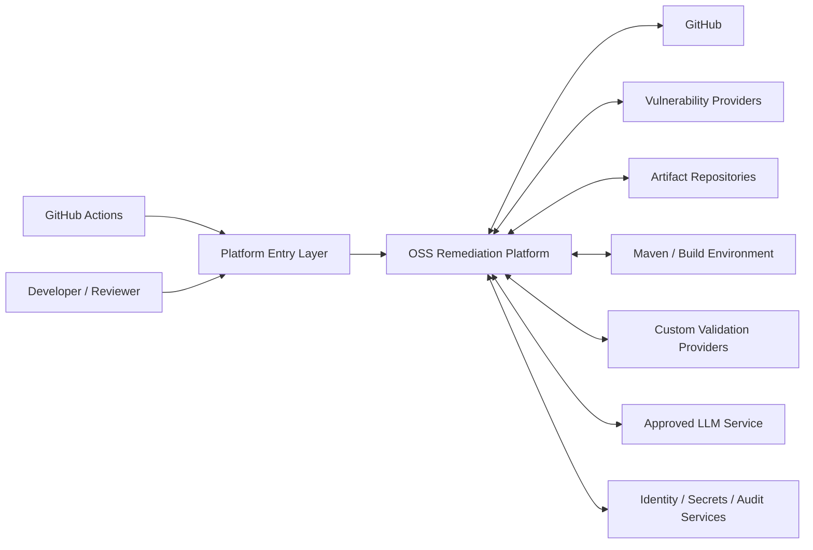
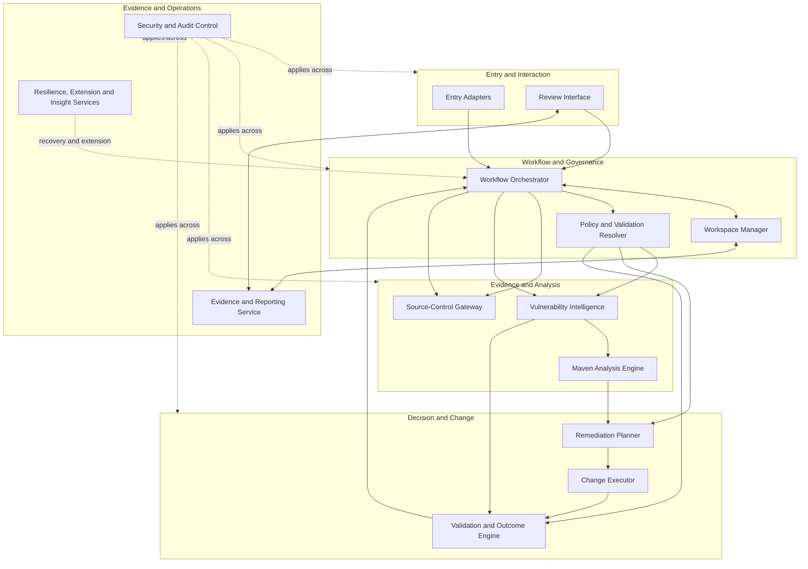
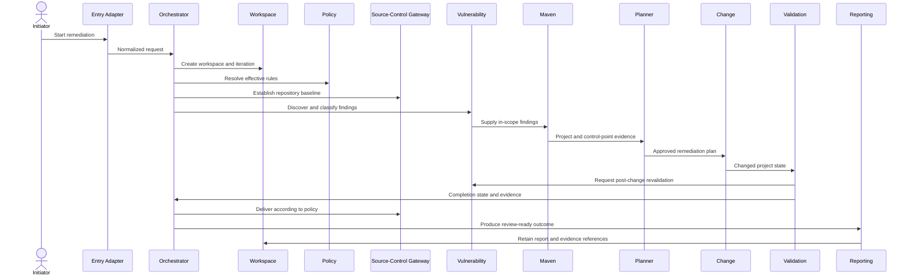
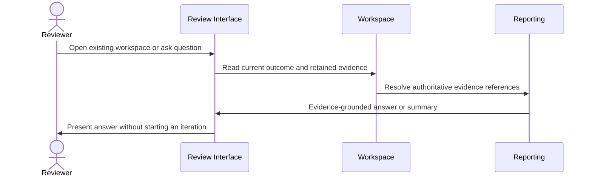
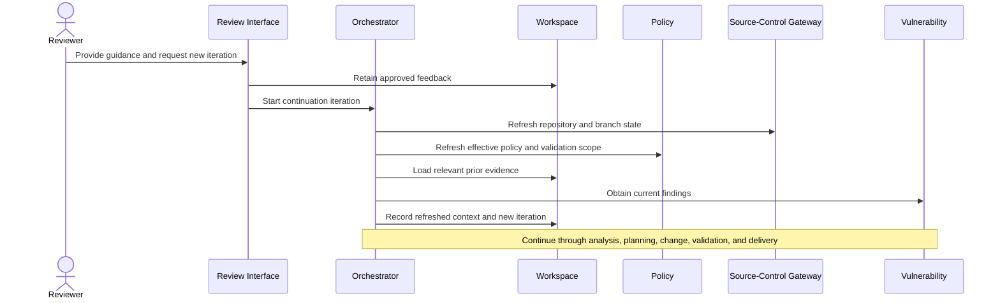

# Enterprise OSS Remediation Platform
## System Architecture

**Status:** Draft for review  
**Version:** 0.1

---

## 1. Purpose

This document defines the logical architecture that fulfills the approved platform responsibilities while preserving the authoritative [Business Remediation Workflow](./01-business-requirements.md#8-business-remediation-workflow).

It is authoritative for:

- logical architectural components
- component boundaries and responsibility allocation
- major interactions and integration boundaries
- workspace, evidence, and technical-state ownership
- placement of ADK/LLM reasoning versus deterministic execution

It does not redefine business behavior, platform capabilities, or responsibility ownership. It also does not define prompts, APIs, storage schemas, classes, deployment manifests, or implementation packages; those belong to Detailed Design.

---

## 2. Architecture Principles

1. **Business workflow remains authoritative.** Architecture maps to the workflow; it does not replace it.
2. **One responsibility owner per capability.** Components preserve the ownership defined in the [Platform Responsibility Model](./03-platform-responsibility-model.md).
3. **Deterministic evidence is authoritative.** Repository state, Maven resolution, vulnerability results, builds, tests, and validation outcomes come from deterministic tools or external systems.
4. **LLM reasoning is bounded.** LLMs support contextual analysis, option generation, ranking, explanation, and review interaction, but do not fabricate tool results or independently approve changes.
5. **Workspace continuity is explicit.** Review-only access is separated from a new remediation iteration.
6. **Current facts and retained history are distinct.** New iterations refresh current facts and reassess relevant prior evidence.
7. **Change execution and approval are separated.** The component that applies changes does not determine final completion.
8. **Provider boundaries are pluggable.** GitHub, vulnerability, validation, and future integration providers are accessed through stable architectural ports.
9. **Security, authorization, and audit are cross-cutting.** They apply to every entry point, component, tool call, and retained artifact.
10. **Operational insight cannot silently change runtime behavior.** Product-learning data informs later approved changes only.

---

## 3. System Context

### System boundary

Inside the platform boundary:

- workflow coordination
- workspace and evidence management
- policy resolution
- vulnerability normalization and classification
- Maven analysis
- remediation planning
- permitted change execution
- validation and completion assessment
- reporting and interactive review support

Outside the platform boundary:

- source-control authority
- CI/CD execution environment
- vulnerability-source authority
- Maven artifact repositories and build infrastructure
- approved LLM service
- enterprise identity, secrets, and audit services
- repository-specific validation systems

---

## 4. Logical Component Model

---

## 5. Component Responsibilities

| Component | Architectural purpose | Primary responsibility mapping | Key capabilities |
|---|---|---|---|
| Entry Adapters | Accept CI/CD and authorized interactive requests and normalize them into platform commands | RESP-01, supporting RESP-02 and RESP-11 | CAP-01, CAP-06, CAP-25 |
| Review Interface | Present workspace evidence, accept questions and feedback, and distinguish review-only actions from new-iteration requests | RESP-10, supporting RESP-01 and RESP-04 | CAP-22, CAP-23, CAP-24 |
| Workflow Orchestrator | Coordinate workflow stages, iterations, failure-informed retries, continuation, and termination | RESP-01 | CAP-06, CAP-14, CAP-24 |
| Policy and Validation Resolver | Resolve the effective policy, severity threshold, exclusions, remediation boundary, delivery policy, and validation scope | RESP-03 | CAP-02, CAP-03; supports CAP-08 |
| Workspace Manager | Own persistent workspace identity, current iteration state, history, collaboration control, and evidence references | RESP-04 | CAP-04, CAP-05, CAP-21 |
| Source-Control Gateway | Read authoritative repository state and manage remediation branches, commits, pushes, and pull requests | RESP-02 | CAP-01, CAP-19, CAP-20 |
| Vulnerability Intelligence | Obtain, normalize, classify, and re-evaluate vulnerability findings using resolved policy | RESP-05 | CAP-07, CAP-08, CAP-16 |
| Maven Analysis Engine | Produce deterministic reactor, dependency-origin, effective-model, and control-point evidence | RESP-06 | CAP-09, CAP-10 |
| Remediation Planner | Determine, compare, select, and explain remediation options using policy and evidence | RESP-07 | CAP-11, CAP-12; supports CAP-14 |
| Change Executor | Convert an approved remediation plan into permitted project-file changes | RESP-08 | CAP-13 |
| Validation and Outcome Engine | Execute configured validation and assign exactly one supported completion state | RESP-09 | CAP-15, CAP-17, CAP-18; consumes CAP-16 evidence |
| Evidence and Reporting Service | Create reviewer-facing reports and explanations from retained authoritative evidence | RESP-10, supporting RESP-04 | CAP-22, CAP-23 |
| Security and Audit Control | Enforce identity, authorization, sensitive-data protection, and audit capture across all components | RESP-11 | CAP-25, CAP-26, CAP-27 |
| Resilience, Extension and Insight Services | Coordinate recoverable conditions, provider extension contracts, and aggregated operational insights | RESP-12 | CAP-28, CAP-29, CAP-30 |

A component may support capabilities owned by another responsibility, but it must not assume that responsibility's authoritative decision or state ownership.

---

## 6. ADK, LLM, and Deterministic Execution Boundaries

### ADK-coordinated components

The initial implementation may use ADK for:

- Workflow Orchestrator
- Remediation Planner
- Review Interface orchestration
- explanation and contextual reasoning within Evidence and Reporting

ADK is the orchestration framework, not the source of deterministic technical truth.

### LLM-assisted decisions

LLM reasoning may support:

- interpreting project and vulnerability context
- generating candidate remediation options
- comparing compatibility and risk tradeoffs
- explaining selected and rejected options
- analyzing failure evidence to revise a plan
- answering reviewer questions from retained evidence

LLM output remains a proposal or explanation until grounded by policy and deterministic evidence.

### Deterministic components and tools

Deterministic execution is required for:

- repository and branch state
- Maven reactor and effective-model analysis
- dependency-tree and origin evidence
- vulnerability-provider responses
- project-file modification operations
- Maven builds and tests
- custom validation execution
- post-change vulnerability revalidation
- completion-state rule evaluation
- source-control delivery state

---

## 7. Workspace and State Architecture

The Workspace Manager is the authoritative owner of durable remediation context. It retains references to evidence produced by other authoritative components without replacing their technical ownership.

### Workspace-level state

- repository and reference-branch identity
- workspace identity and access metadata
- current outcome and related pull-request state
- iteration history
- review conversations and approved guidance
- collaboration and active-update control
- evidence and artifact references

### Iteration-level state

- current repository revision
- effective policy and validation configuration
- current vulnerability findings and scope classification
- Maven analysis evidence
- candidate and selected remediation plan
- applied changes
- validation results
- completion state
- rejected options, failures, risks, and next actions

### Continuation behavior

Review-only access reads retained workspace state and evidence without starting a new iteration.

A new iteration:

1. refreshes current repository, branch, policy, validation, and reviewer-guidance context
2. loads relevant retained evidence
3. obtains current vulnerability findings
4. reassesses prior conclusions against current facts
5. continues through analysis, planning, execution, validation, and delivery

The detailed storage model, schema, versioning mechanism, and relevance-selection algorithm belong to Detailed Design.

---

## 8. Major Runtime Flows

### 8.1 New remediation

### 8.2 Review-only access

### 8.3 Feedback-driven new iteration

---

## 9. Integration Boundaries

| Integration | Initial implementation | Architectural boundary |
|---|---|---|
| Source control | GitHub | Source-Control Gateway hides provider-specific repository, branch, commit, and PR operations |
| CI/CD | GitHub Actions | Entry Adapter translates workflow inputs into a normalized remediation request |
| Interactive access | ADK-supported web or terminal interface | Review/Entry interfaces do not directly own workflow or evidence state |
| Vulnerability source | Configured provider or supported findings input | Vulnerability Intelligence normalizes provider-specific results |
| Build and dependency analysis | Maven and configured artifact repositories | Maven Analysis and Validation components invoke deterministic tools |
| Custom validation | Repository or organization-defined providers | Validation and Outcome Engine invokes configured validation ports |
| LLM | Approved enterprise LLM service | LLM access is limited to bounded reasoning and explanation use cases |
| Identity, secrets, audit | Enterprise services | Security and Audit Control applies consistent access and protection rules |

Future Bitbucket, TeamCity, vulnerability, and validation integrations must implement the same architectural boundaries rather than modify core workflow ownership.

---

## 10. State and Evidence Ownership

| State or evidence | Authoritative component |
|---|---|
| Repository, branch, commit, and pull-request state | Source-Control Gateway / source-control provider |
| Effective policy and validation scope | Policy and Validation Resolver |
| Workspace identity, lifecycle, iteration history, and evidence references | Workspace Manager |
| Normalized vulnerability findings and classification | Vulnerability Intelligence |
| Maven project, origin, and control-point evidence | Maven Analysis Engine |
| Candidate options, selected plan, rejected alternatives, and rationale | Remediation Planner |
| Applied project-file change set | Change Executor |
| Build, test, custom-validation results, and completion state | Validation and Outcome Engine |
| Reviewer-facing reports and evidence-grounded explanations | Evidence and Reporting Service |
| Access decisions and protected audit records | Security and Audit Control |
| Aggregated operational insights | Resilience, Extension and Insight Services |

Workspace storage may retain copies or references for continuity, but it does not become the authoritative generator of technical evidence owned elsewhere.

---

## 11. Security and Trust Boundaries

The architecture must enforce:

- authenticated and authorized repository and workspace access
- least-privilege credentials for GitHub, artifact repositories, providers, and LLM services
- separation between user input, retained evidence, tool output, and model-generated content
- secret redaction from logs, reports, prompts, and workspace evidence
- audit events for significant workflow, policy, change, validation, delivery, and review actions
- controlled execution of repository-provided build and validation commands
- protection against untrusted repository content influencing privileged operations
- retention and aggregation controls for workspace-specific and operational-insight data

Specific controls, identity roles, sandboxing choices, and retention periods remain Detailed Design or unresolved business decisions where applicable.

---

## 12. Resilience and Recovery

The Workflow Orchestrator and Workspace Manager must support resumable iterations with explicit states rather than infer success from process completion.

Recoverable conditions include:

- provider or network interruption
- build-environment interruption
- stale reference-branch state
- interrupted orchestration
- temporary artifact-repository failure
- LLM-service unavailability for a reasoning step

Recovery must preserve completed evidence, identify the failed stage, and resume or restart only the affected work where safe. The platform must not report Fully or Partially Remediated without the required validation and completion-state evidence.

---

## 13. Workflow-to-Architecture Mapping

| Business workflow stage | Primary components | Primary responsibilities |
|---|---|---|
| Start or resume | Entry Adapters, Workflow Orchestrator, Workspace Manager | RESP-01, RESP-04 |
| Review existing workspace | Review Interface, Workspace Manager, Evidence and Reporting | RESP-10, RESP-04 |
| Capture feedback | Review Interface, Workspace Manager, Workflow Orchestrator | RESP-10, RESP-04, RESP-01 |
| Refresh context | Workflow Orchestrator, Source-Control Gateway, Policy Resolver | RESP-01, RESP-02, RESP-03 |
| Load retained context | Workspace Manager | RESP-04 |
| Vulnerability discovery | Vulnerability Intelligence | RESP-05 |
| Assess current and retained evidence | Workflow Orchestrator, Vulnerability Intelligence, Maven Analysis, Remediation Planner | RESP-01, RESP-05, RESP-06, RESP-07 |
| Scope classification | Policy Resolver, Vulnerability Intelligence | RESP-03, RESP-05 |
| Project analysis | Maven Analysis Engine | RESP-06 |
| Remediation decision | Remediation Planner | RESP-07 |
| Change execution | Change Executor, Source-Control Gateway | RESP-08, supporting RESP-02 |
| Validation | Validation and Outcome Engine, Vulnerability Intelligence | RESP-09, supporting RESP-05 |
| Completion | Validation and Outcome Engine, Workflow Orchestrator | RESP-09, supporting RESP-01 |
| Delivery | Source-Control Gateway, Evidence and Reporting | RESP-02, RESP-10 |
| Retention | Workspace Manager, Security and Audit Control | RESP-04, RESP-11 |

---

## 14. Architecture Decisions Requiring ADRs

The following decisions should be recorded before or during Detailed Design:

1. workspace persistence technology and evidence-storage strategy
2. ADK orchestration topology and agent boundaries
3. deterministic tool-execution isolation and sandboxing
4. vulnerability-provider interface and initial provider selection
5. completion-state rule implementation approach
6. concurrency and duplicate-workspace control
7. branch and commit-history strategy across iterations
8. authentication, authorization, and role model
9. operational-insight aggregation and privacy boundary
10. deployment topology and recovery model

An ADR does not override the Business Requirements, Capability Model, or Platform Responsibility Model unless those authoritative documents are also updated through the approved change process.

---

## 15. Architecture Review Criteria

This architecture is ready for baselining when reviewers confirm that:

1. every business-workflow stage maps to components
2. every component maps to approved capabilities and responsibilities
3. authoritative state and evidence ownership are unambiguous
4. review-only access cannot accidentally start a new iteration
5. continued iterations refresh current facts and reuse relevant history
6. LLM reasoning is bounded by deterministic evidence and policy
7. change execution cannot approve its own outcome
8. source-control, vulnerability, validation, identity, and LLM boundaries are replaceable where required
9. security, audit, resilience, and operational-insight boundaries are explicit
10. unresolved decisions are assigned to ADRs or Detailed Design rather than silently assumed

---

## 16. Next Step

Review this architecture against:

- the [Business Remediation Workflow](./01-business-requirements.md#8-business-remediation-workflow)
- the [Capability Model](./02-capability-model.md)
- the [Platform Responsibility Model](./03-platform-responsibility-model.md)

After architecture approval, create `05-detailed-design.md` and the required ADRs for decisions that must be settled before implementation.
