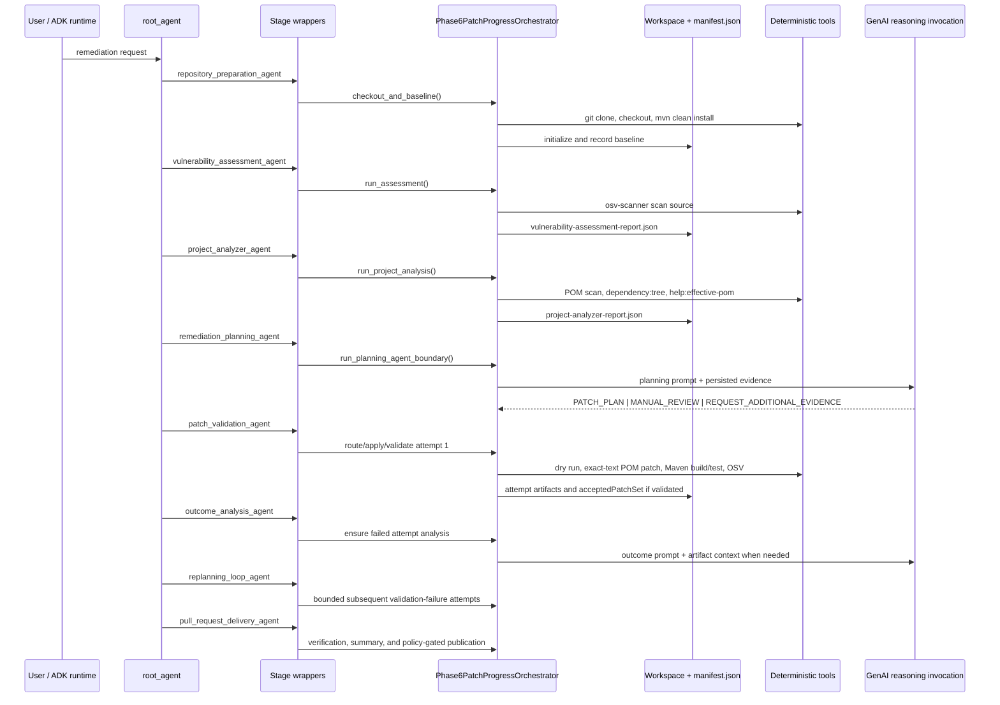
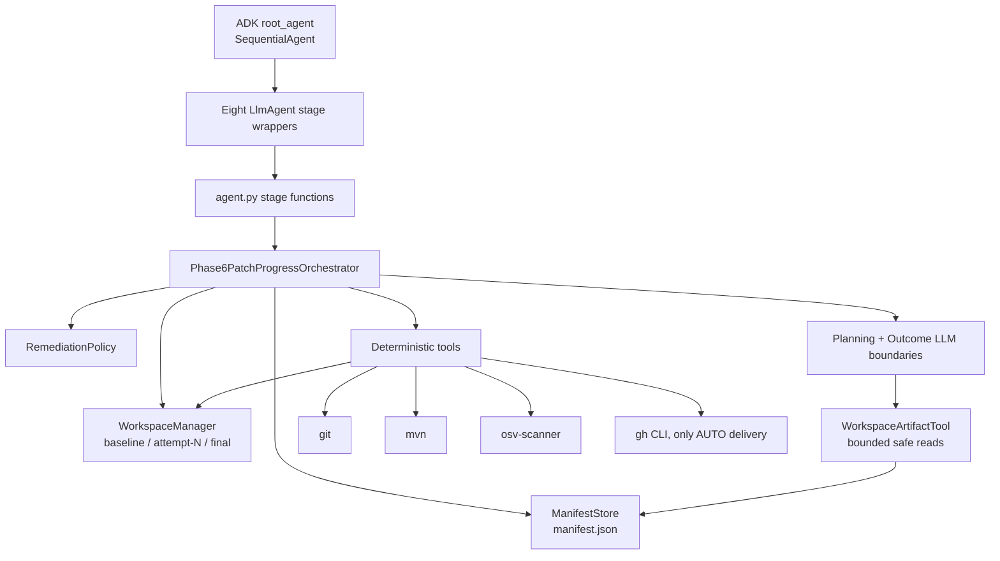

# Current Codebase Reference

This reference is derived from the implementation under `oss_remediation_agent/` and root build configuration only. It intentionally does not rely on repository documentation, tests, runtime workspaces, logs, or generated reports.

## 1. Project Overview

This is a Python implementation of an ADK-oriented workflow for remediating in-scope OSS vulnerabilities in Maven projects. The executable ADK entry module is `oss_remediation_agent/agent.py`; a root-level `agent.py` is not present.

The system combines:

- ADK `SequentialAgent`/`LlmAgent` wrappers for a fixed stage graph;
- deterministic Python tools for Git checkout, Maven/OSV execution, artifact creation, patch application, validation, and optional GitHub PR delivery;
- two LLM reasoning boundaries: remediation planning and failed-outcome analysis;
- a workspace-local `manifest.json` as the workflow state and artifact index.

The primary runtime orchestrator class is `Phase6PatchProgressOrchestrator`, inheriting behavior through `Phase6WorkflowOrchestrator`, `Phase5WorkflowOrchestrator`, and `WorkflowOrchestrator`.

## 2. Business Objective

Automatically identify Critical and High Maven vulnerabilities, determine an evidence-backed minimal POM-only remediation, apply it in an isolated attempt workspace, validate the result, and—when policy permits—create a draft GitHub pull request. The implementation targets Maven repositories and collects Spring Boot signals, but it does not require Spring Boot detection to run.

## 3. Repository Structure

| Path | Implementation role |
|---|---|
| `oss_remediation_agent/agent.py` | ADK staged entry points, eight ADK agents, and `root_agent`. |
| `oss_remediation_agent/cli.py` | Minimal CLI that performs only checkout and baseline build. |
| `oss_remediation_agent/workflow/` | Lifecycle orchestration, final summaries, verification reporting. |
| `oss_remediation_agent/agents/` | LLM invocation adapter, planning/outcome context and artifact persistence, artifact catalog. |
| `oss_remediation_agent/tools/` | Deterministic checkout, scan, Maven analysis, patching, validation, artifact access, PR summary/publication. |
| `oss_remediation_agent/workspace/` | Workspace initialization, JSON manifest persistence, attempt directory helpers. |
| `oss_remediation_agent/policies/` and `config/` | Policy model and default YAML policy. |
| `oss_remediation_agent/contracts/` | Dataclass representations and normalized tool/artifact result helpers. |
| `oss_remediation_agent/schemas/` | JSON Schema contract files. |
| `oss_remediation_agent/prompts/` | Prompt assets used by the two reasoning agents. |
| `oss_remediation_agent/utils/` | Command execution and lightweight artifact-result validation. |
| `Makefile`, `run_tests.py` | Compile/test command configuration. |

## 4. Repository Reading Guide

Read in this order:

1. `oss_remediation_agent/agent.py` — public workflow/stage functions and the ADK `root_agent` graph.
2. `workflow/phase6_patch_progress_orchestrator.py`, `phase6_orchestrator.py`, `phase5_orchestrator.py`, then `orchestrator.py` — inheritance refinements followed by the base lifecycle.
3. `policies/remediation_policy.py` and `config/remediation-policy.yaml` — constraints and delivery mode defaults.
4. `agents/remediation_planning_agent.py`, `agents/remediation_outcome_analysis_agent.py`, and `agents/__init__.py` — LLM boundaries, context construction, bounded artifact-tool rounds.
5. Tools in runtime order: `repo_checkout_tool.py`, `baseline_build_tool.py`, `osv_scanner_tool.py`, `maven_project_tool.py`, `generic_patch_apply_tool.py`, `validation_tool.py`, `pr_creation_tool.py`, `pr_publisher_tool.py`.
6. `workspace/`, `agents/artifact_catalog.py`, and `tools/workspace_artifact_tool.py` — persisted evidence and safe LLM access.
7. `workflow/remediation_verification_report.py` and `workflow/final_response_summary.py` — delivery artifacts and user-facing outcome formatting.
8. `contracts/`, `schemas/`, `utils/`, and then the remaining tools — contract intent and unused/legacy surfaces.

## 5. Execution Flow

### ADK entry path

`root_agent` is a `SequentialAgent` containing eight `LlmAgent` subagents. Each wrapper is instructed to call exactly one Python stage function and pass `workspaceRoot` from a prior output key. The stage agents themselves use `gemini-2.5-flash`; the internal reasoning invoker also defaults to `gemini-2.5-flash`, overridable by `OSS_REMEDIATION_LLM_MODEL`.

### Non-ADK entry paths

`run_oss_remediation_workflow()` directly invokes the full deterministic orchestrator lifecycle. `cli.py` is not equivalent: it calls only `checkout_and_baseline()`. Individual `run_*_stage` functions support staged ADK execution and reconstruct an orchestrator per call from the supplied workspace.

## 6. Architecture

The orchestrator owns ordering, manifest updates, retries, and policy-gated delivery. Planning and outcome analysis are intentionally delegated to LLM JSON outputs; deterministic code persists and routes those outputs rather than selecting dependency versions itself.

## 7. Agent Catalog

| Agent | Purpose and responsibilities | Inputs / outputs | Dependencies and orchestration | Status |
|---|---|---|---|---|
| `repository_preparation_agent` | Calls Stage 1 checkout and baseline build. | User repository URL/branch; `repository_preparation_result`. | `run_repository_preparation_stage` → checkout + baseline build. | Implemented. |
| `vulnerability_assessment_agent` | Calls OSV assessment. | Prior `workspaceRoot`; `vulnerability_assessment_result`. | Stage 2 reads manifest baseline repository. | Implemented. |
| `project_analyzer_agent` | Calls Maven analysis. | Prior `workspaceRoot`; `project_analysis_result`. | Stage 3 collects POM/dependency evidence. | Implemented. |
| `remediation_planning_agent` (ADK wrapper) | Calls the planning boundary. | Prior workspace; `remediation_planning_result`. | Stage 4 invokes internal `RemediationPlanningAgent`. | Implemented wrapper. |
| `RemediationPlanningAgent` (reasoning boundary) | Produces a JSON `PATCH_PLAN`, `MANUAL_REVIEW`, or `REQUEST_ADDITIONAL_EVIDENCE`. | Prompt, policy, manifest/artifact references, compact evidence; persisted decision artifact. | Invoked through `GoogleGenAIJsonInvoker` or injection; cannot mutate through its output contract. | Implemented, runtime depends on GenAI SDK/credentials/model. |
| `patch_validation_agent` | Calls planner-result routing, dry run, patching, validation. | Prior workspace; `patch_validation_result`. | Stage 5 invokes patch lifecycle on the selected attempt. | Implemented. |
| `outcome_analysis_agent` (ADK wrapper) | Ensures failure outcome analysis exists where required. | Prior workspace; `outcome_analysis_result`. | Stage 6 invokes internal Outcome Analysis when no accepted patch set. | Implemented wrapper. |
| `RemediationOutcomeAnalysisAgent` (reasoning boundary) | Produces evidence-backed failed-outcome JSON. | Prompt, catalog, selected compact artifacts; persisted summary. | Invoked after dry-run, apply, or validation failure. | Implemented, runtime depends on GenAI SDK/credentials/model. |
| `replanning_loop_agent` | Continues attempts after a validation failure. | Prior workspace; `replanning_loop_result`. | Stage 6b loops only while current state requires validation-failure replan. | Implemented. |
| `pull_request_delivery_agent` | Generates final delivery artifacts and attempts draft PR publication if policy allows. | Prior workspace; final response text. | Stage 7 calls `_finalize_pr_lifecycle` only with a validated patch set. | Implemented, external delivery conditional. |

`SCANNER_AGENT_INSTRUCTION`, `REMEDIATION_AGENT_INSTRUCTION`, and `VALIDATION_AGENT_INSTRUCTION` in `prompts.py` are constants only; no implemented runtime references them.

## 8. Workflow Lifecycle

1. Initialize `baseline/`, `final/`, and a new manifest with policy and repository metadata.
2. Clone repository into `baseline/repository`, check out the specified branch, record HEAD, and run `mvn clean install`. Any failed baseline stops the full workflow.
3. Run `osv-scanner scan source -r <temporary copy> --format json`; normalize Maven findings and retain only configured severities.
4. Discover all `pom.xml` files, collect root POM facts, POM snippets, `mvn dependency:tree`, and `mvn help:effective-pom`. Dependency/effective-POM command failures produce a `PARTIAL` analysis, which is still accepted by the workflow.
5. Persist planning context and invoke the LLM. Additional evidence requests are handled in the same planning cycle and do not consume a remediation attempt; per-attempt requests are bounded by policy.
6. For `PATCH_PLAN`, lazily copy the clean baseline into `attempt-N/repository`, replay any previously accepted patches filtered by accepted IDs, dry-run exact-text patches, then apply atomically.
7. Validate changed-file scope, run Maven build, run Maven test, and run post-remediation OSV. Validation success creates `acceptedPatchSet` from applied patch IDs and vulnerable decisions.
8. Failure in dry run, application, or validation creates/persists outcome-analysis context and invokes the outcome LLM. The Phase 5 loop marks `REPLANNING` and advances attempts after completed outcome analysis.
9. At terminal routing, generate a remediation verification report and PR summary. Delivery mode controls whether publication is disabled, summary-only, manual-approval, or auto-published.

## 9. Configuration

`config/remediation-policy.yaml` defines: Critical/High scope, three attempts, two additional investigations per attempt, partial PR allowance, `**/pom.xml` file allowance, prohibited source/JDK/plugin/suppression/formatting change categories, and allowed Maven version change types.

`RemediationPolicy.load()` is a hand-written line parser, not a YAML parser. It reads the fields above and can read a nested `prCreationPolicy`; the committed YAML does not specify PR creation policy, so dataclass defaults apply: `AUTO`, draft creation enabled, validated set required, manual-approval PR creation disabled.

Relevant environment variables:

- `OSS_REMEDIATION_LLM_MODEL` — internal LLM model override.
- `OSS_REMEDIATION_MAX_TOOL_ROUNDS` — maximum additional workspace-artifact tool rounds; default 3.

No dependency manifest (`pyproject.toml`, `requirements.txt`, or equivalent) is present. Unable to verify from implementation how dependencies are provisioned.

## 10. Prompt & Instruction Files

| File | Use |
|---|---|
| `prompts/remediation_planning_agent.md` | Loaded by `build_planning_context()`. It directs evidence-bound patch/manual/evidence-request decisions, fixed-version restrictions, Maven ownership strategy, exact-text patch fields, and JSON-only output. |
| `prompts/remediation_outcome_analysis_agent.md` | Loaded by `build_outcome_analysis_context()`. It directs evidence-backed failure classification, responsibility assessment, disposition, and JSON-only output without patch generation. |
| `prompts/remediation_planning_milestone2.md` | Referenced conditionally and appended if present; it is absent from the inspected implementation tree. |
| `prompts/remediation_outcome_analysis_milestone2.md` | Referenced conditionally and appended if present; it is absent from the inspected implementation tree. |
| `prompts.py` | Contains three generic legacy instruction constants. No call site was found. |
| Inline `LlmAgent.instruction` values in `agent.py` | Route each fixed ADK stage and pass output-key workspace state. |

## 11. External Integrations

- Google ADK: imports `LlmAgent` and `SequentialAgent` and exposes `root_agent`.
- Google GenAI: lazy `google.genai.Client()` invocation for planning/outcome JSON. Credentials/configuration mechanism is not configured in code; unable to verify from implementation.
- Git: clone, checkout, rev-parse, diff, status, add, commit, push.
- Maven: baseline/validation `mvn clean install`, validation `mvn test`, analyzer `dependency:tree` and `help:effective-pom`.
- OSV Scanner: source scan JSON for baseline and post-remediation validation.
- GitHub CLI: `gh pr create` when auto publication is enabled and all PR preconditions pass.

## 12. Current Features

### Implemented

- Manifest-backed workspace lifecycle and isolated attempt copies.
- Maven POM discovery, basic root project facts, dependency-tree extraction, effective-POM artifact generation.
- OSV Maven finding normalization and Critical/High filtering.
- LLM planning/outcome persistence and limited structured validation.
- Bounded additional investigation routing for `ProjectAnalyzerTool`, `OSVScannerTool`, and manifest/artifact-reference requests.
- Exact-text `pom.xml` patch dry-run/application, diff and proof artifacts.
- Scope/build/test/OSV validation; accepted patch-set construction.
- Remediation verification report, PR summary/description, and policy-gated draft PR publication.
- Safe, workspace-confined artifact reads and bounded log excerpts for LLM use.

### Partially Implemented

- Policy enforcement: policy is supplied to agents and scope validation hard-codes several restrictions, but `allowed_file_patterns`, `blocked_change_types`, and `allowed_patch_change_types` are not centrally enforced against all planner fields before patch execution.
- Schema support: schemas and lightweight validators exist, but no production workflow call validates generated artifacts against JSON Schemas.
- Patch-plan evidence validation: `patch_plan_evidence_validator.py` performs useful checks but is not wired into the execution path.
- Multi-module support: all POMs are indexed and module metadata is collected, but dependency-tree execution is root-only and only root POM properties/parent facts are parsed.
- Partial remediation: lifecycle has partial-PR branches, but accepted patch-set creation follows a successful validation result; no aggregation of separately validated attempts is implemented.
- ADK staging: fixed wrappers expose visible stages, while the direct orchestrator has a richer loop. Stage 5/6b routing handles fewer state combinations than the direct loop.

### Not Implemented

- Deterministic remediation/version selection; this is deliberately LLM-owned.
- Java source, test, JDK, plugin build-logic, or suppression-based remediation.
- A real source of dependency provisioning/packaging configuration in this repository. Unable to verify from implementation.
- Automated use of `remediation_tools.py`, `scanner_tools.py`, and `validation_tools.py`; each contains only mock result functions and no runtime call site.
- Artifact retention/indexing/schema validation beyond the manifest/alias helpers.

## 13. Technical Debt

- `agents/__init__.py` and `agents/llm_invocation.py` duplicate LLM invoker types; the orchestrator imports the former, making the latter unused in the production path.
- Orchestrator behavior is split across inheritance layers and several stage-specific helpers, increasing lifecycle comprehension cost.
- Policy parsing is custom and permissive rather than a YAML library/schema-backed parser.
- JSON schemas, dataclass contracts, and emitted artifact shapes are not consistently enforced together.
- `ArtifactStore` is a `WorkspaceManager` alias with a stated future purpose, not a store abstraction.
- CLI scope differs sharply from advertised workflow entry behavior: it stops after baseline.
- Root tooling contains Unix `find` commands in the Makefile while the repository is being inspected from Windows; portability is not established.

## 14. Stability Risks

- Repository deletion/copy operations use `shutil.rmtree` on workspace paths; a malformed workspace root can be destructive within process permissions.
- The publisher executes `rm -rf` through its command runner for a pre-existing final worktree; platform behavior and quoting are not verified.
- Planner output is only checked for top-level decision type before dry run; unsupported/malformed patch fields can raise exceptions rather than become controlled validation failures.
- Patch application uses raw string replacement. It cannot structurally understand XML and has no explicit defense against overlapping patches that alter a later patch's expected text.
- Maven baseline build has a default 30-minute subprocess timeout; validation Maven commands use the same default. Long projects can time out.
- Scan copies the entire repository (except selected directories) to a temporary directory; large repositories increase time and storage pressure.
- `OSV` severity parsing may classify CVSS vector strings as no score/Low when no explicit textual severity is present.
- PR publication relies on local Git identity, remote permissions, and authenticated `gh`; these prerequisites are only discovered during publication.
- The primary LLM call has no explicit JSON response schema, retry, token budget, or provider credential handling in code.

## 15. Extension Points

- Implement a schema-validating planner gate by wiring `patch_plan_evidence_validator.validate()` before dry run and adding policy checks there.
- Expand `_investigation_tool_registry()` in `WorkflowOrchestrator` with deterministic evidence sources; retain request bounds and artifact persistence.
- Replace POM text patching with a namespace-aware XML strategy while preserving minimal-diff proofs.
- Extend Maven analysis to per-module dependency trees, inherited property resolution, and effective-POM parsing.
- Add a concrete policy serializer/parser and validate the configuration on startup.
- Add a provider adapter for structured LLM response enforcement and richer ADK-native tool calls.
- Add a non-GitHub delivery adapter; delivery currently assumes Git remote and GitHub CLI semantics.

## 16. Current Implementation Status

The code implements an MVP-grade end-to-end workflow with concrete local tools and artifact lifecycle handling. It can attempt a dependency-only POM remediation when its external CLIs, LLM environment, planner output, and GitHub credentials are available. The code does not prove production readiness because key guardrails (schema/policy enforcement and robust structural patching) are present only partially or not wired.

## 17. Known Limitations

- Automated patch target files must be named `pom.xml`; raw patch text must occur exactly the expected number of times.
- Project analysis reads root-level POM facts and does not parse child POM properties/parents comprehensively.
- Assessment accepts Maven packages only and is limited to configured severities.
- A clean post-remediation OSV scan is required, but validation does not explicitly require remaining Critical/High counts to be zero beyond OSV success semantics.
- Outcome-analysis output validation checks required fields and non-emptiness, not detailed schema/value validity.
- PR summary can be created only after the finalization path; no standalone CLI command exposes final delivery.
- Planning-agent tool access is constrained to safe artifact/list/log reads and is limited to three rounds by default.
- No application configuration establishes Google or GitHub authentication.

## 18. Top Priorities

### Critical

1. Wire patch-plan evidence and policy validation into the path before any patch is applied.
2. Replace or harden raw text patching, including overlapping-patch detection and robust malformed-plan handling.

### High

1. Add real dependency/runtime packaging and startup validation for ADK, GenAI, Maven, OSV, Git, and `gh` prerequisites.
2. Make Maven analysis module-aware and resolve ownership from actual effective POM data.
3. Add explicit structured-output enforcement/retries for both LLM boundaries.

### Medium

1. Consolidate duplicate LLM adapters and simplify inheritance/stage lifecycle ownership.
2. Replace the custom YAML parser with validated configuration loading.
3. Reconcile or remove unused mock tools and dormant contract/schema utilities.

### Low

1. Align the minimal CLI with the full workflow or clearly constrain it in code-facing interfaces.
2. Improve Makefile portability and remove shell-specific cleanup assumptions.
